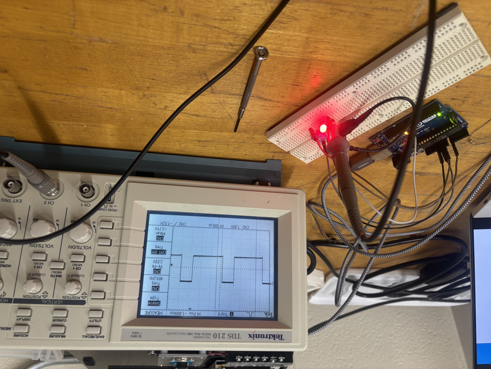
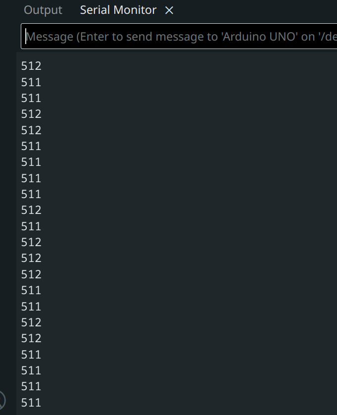
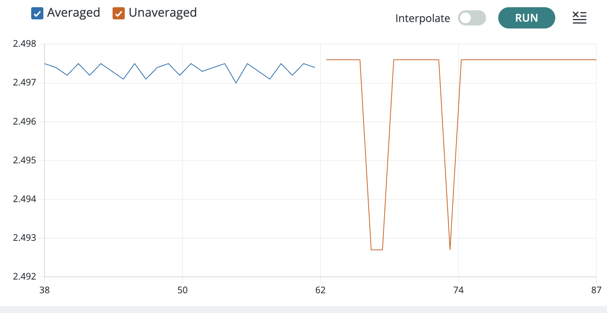
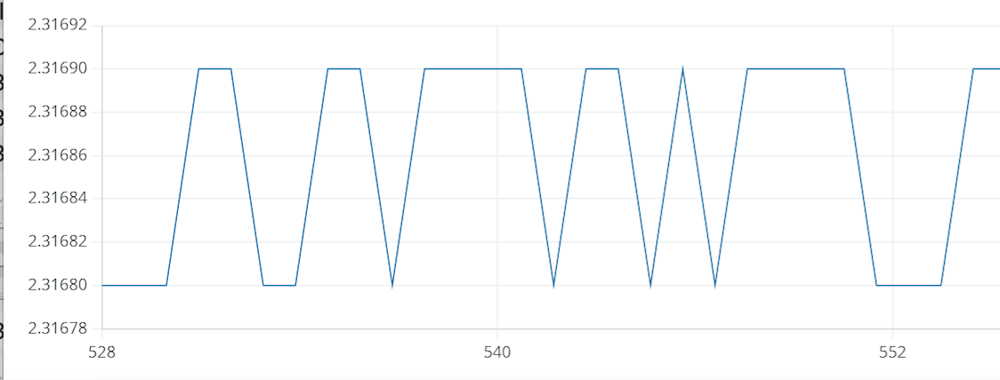
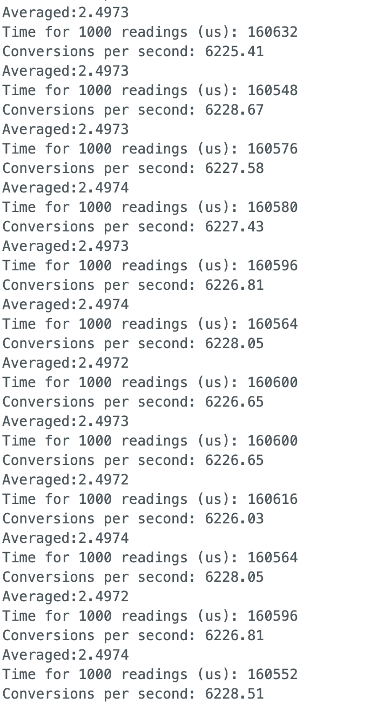

# A1: Module 1 Evidence Note

| Item | Information |
|---|---|
| Team members | Ben Kadener and Kian Wijnaendts |
| Date | September 9, 2026 |
| Repository | [Phys39A-TEC9](https://github.com/kianw-devel/Phys39A-TEC9) |
| Full Git commit hash | **UPDATE AFTER FINAL COMMIT AND PUSH** |

## Apparatus

The photograph shows the Arduino Uno at lower left, the potentiometer and LED circuit on the breadboard, the oscilloscope probe connected to the circuit, and the oscilloscope displaying the PWM waveform.

## Arduino sketches

- [Blink.ino](../../Module1/Blink/Blink.ino)
- [AnalogReadSerial.ino](../../Module1/AnalogReadSerial/AnalogReadSerial.ino)
- [3_Convert_ADC.ino](../../Module1/3_Convert_ADC/3_Convert_ADC.ino)
- [4_LED_Brightness.ino](../../Module1/4_LED_Brightness/4_LED_Brightness.ino)

## ADC digitization results

With the potentiometer held near its selected midrange position, the measured ADC readings hovered between 511 and 512.

| Quantity | Measured value |
|---|---:|
| Minimum ADC value | 0 counts |
| Maximum ADC value | 1023 counts |
| Midrange ADC value, $(0+1023)/2$ | 511.5 counts |

For the 5.00 V reference, the one-count ADC voltage resolution is

$$
\Delta V=\frac{5.00\ \mathrm{V}}{1023}=0.00488\ \mathrm{V}=4.88\ \mathrm{mV/count}.
$$

The readings occupy discrete levels because the Arduino Uno uses a 10-bit ADC, which represents the input using only the 1024 integer codes from 0 through 1023. Small electrical noise and  reference-voltage variation caused the reading to alternate. Printing additional decimal places cannot create finer physical ADC resolution.

## Averaging results

The centered Serial Plotter comparison shows the transition between the 100-point unaveraged ($N=1$) block and the 100-point long-average ($N=1000$) block.

### $N=1000$-only plot

### Averaging table

| Potentiometer block | Reported points | Readings averaged per point $N$ | Mean voltage | Sample standard deviation $s$ | Measured $s/s_1$ | Predicted $s/s_1$ |
|---|---:|---:|---:|---:|---:|---:|
| Unaveraged | 100 | 1 | 2.4974 V | 1.8 mV | 1.000 | 1.000 |
| Long average | 100 | 1000 | 2.4973 V | 0.3 mV | 0.1774 | 0.0316 |

The smallest voltage jump visible in the $N=1000$ plot is $2.31690\ \mathrm{V}-2.31680\ \mathrm{V}=0.00010\ \mathrm{V}=0.10\ \mathrm{mV}$.

The measured noise ratio was 0.1774, compared with the ideal prediction

$$
\frac{s}{s_1}=\frac{1}{\sqrt{1000}}=0.0316.
$$

The measured reduction was smaller than the ideal prediction because the errors were not entirely random and independent. Drift, correlated electrical pickup, ADC quantization, and reference-voltage variation can remain after averaging. Averaging improves precision, but it does not necessarily improve absolute accuracy or remove calibration errors.

## Time for 1000 readings

The measured times in this screenshot ranged from 160,548 to 160,632 microseconds for 1000 readings, with conversion rates of approximately 6225 to 6229 conversions per second. A representative result is **160.6 ms for 1000 readings**, or approximately **6.23 kHz**.

Averaging improves precision because independent positive and negative fluctuations tend to cancel. A finite average also acts as a low-pass filter: rapid changes during the approximately 160.6 ms averaging interval are smoothed, so improved voltage precision comes with reduced time resolution.

## LED PWM oscilloscope results

The oscilloscope capture resolves the individual PWM pulses. It reports a frequency of 489.2 Hz and a peak-to-peak voltage of 2.72 V. The period calculated from the measured frequency is

$$
T=\frac{1}{489.2\ \mathrm{Hz}}=2.044\ \mathrm{ms}.
$$

- High voltage: 2.72V
- Low voltage: 0V
- Period: 2.044 ms
- Frequency: 489.2 Hz
- Duty cycle: $D=(t_{\mathrm{HIGH}}/T)\times100=(1.2\ \mathrm{div}/4.1\ \mathrm{div})\times100=29.3\text{ percent}\approx30\text{ percent}$

The oscilloscope showed the voltage physically present at the output pin, including the individual high and low pulses and their timing. The Serial Monitor and Serial Plotter showed values chosen and printed by the program rather than the PWM waveform itself. The oscilloscope therefore revealed that the apparently continuous LED brightness was produced by rapid switching, not by a steady output voltage.

## AI-use statement

We used AI to help outline, organize, and improve the wording of this evidence note. All experimental measurements came from our laboratory work, and we reviewed and verified the calculations using those measurements.