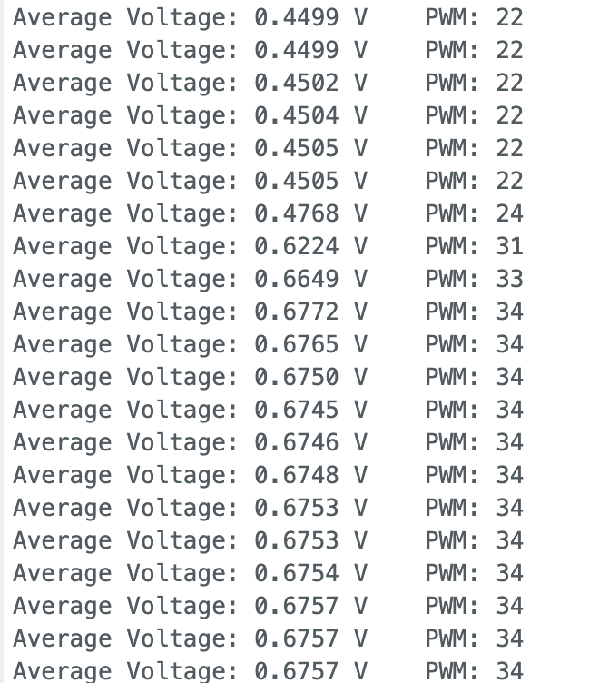

# A1: Module 1 Evidence Note

| Item | Information |
|---|---|
| Assessment | A1 |
| Team members | Ben Kadener and Kian Wijnaendts |
| Date of experiment | September 9, 2026 |
| Repository | [Phys39A-TEC9](https://github.com/kianw-devel/Phys39A-TEC9) |
| Git checkpoint | `9e22041eb826f7e8b37d52d40fc6d14ad192b86b` (current checkpoint before this note is committed) |

> **Submission check:** Replace the Git checkpoint above with the full hash of the commit containing the final note and evidence. The repository currently contains only one oscilloscope setting and no measured Blink trace; complete the items marked **NEEDS MEASUREMENT** before exporting the PDF.

## Arduino sketches used

- [AnalogReadSerial.ino](Module1/AnalogReadSerial/AnalogReadSerial.ino) — raw ADC readings for the digitization observation
- [3_Convert_ADC.ino](Module1/3_Convert_ADC/3_Convert_ADC.ino) — conversion to voltage, 100-point data blocks, and 1000-reading averaging
- [Blink.ino](Module1/Blink/Blink.ino) — digital Blink waveform
- [4_LED_Brightness.ino](Module1/4_LED_Brightness/4_LED_Brightness.ino) — potentiometer-controlled PWM on pin 9

## 1. ADC digitization

With the potentiometer held near its midpoint, the Serial Monitor alternated between ADC codes 511 and 512.

| Quantity | Result |
|---|---:|
| Minimum ADC code | 0 counts |
| Maximum ADC code | 1023 counts |
| Midrange, $(0+1023)/2$ | 511.5 counts |
| Nominal reference voltage | 5.00 V |
| One-count resolution, $5.00\text{ V}/1023$ | 4.89 mV/count |

The readings varied even though the potentiometer was not intentionally moved. They did **not** change continuously: the 10-bit ADC can return only one of 1024 integer codes, from 0 through 1023. Near this operating point, small electrical noise, reference-voltage variation, and quantization caused the result to switch between two neighboring codes. Printing more decimal places after converting a code to volts does not create additional physical resolution, because every printed voltage still came from one of those discrete ADC codes.

The Serial Monitor makes exact numerical values and one-count changes easy to read. The Serial Plotter makes trends, spread, drift, and the relative noise of two signals easier to compare, although exact values are harder to extract.

## 2. Averaging

The sketch collected a block of 100 individual readings and a block of 100 reported values, each of which was the average of 1000 ADC conversions. The centered Serial Plotter view shows that the averaged signal has a much smaller spread.

| Samples per reported value, $N$ | Mean voltage | Measured standard deviation | Smallest visible/reported voltage step | Measured ratio $s_N/s_1$ | $1/\sqrt{N}$ prediction |
|---:|---:|---:|---:|---:|---:|
| 1 | 2.4974 V | 0.0018 V | about 0.0049 V (one ADC count) | 1.0000 | 1.0000 |
| 1000 | 2.4973 V | 0.0003 V | 0.0001 V (limited by displayed precision) | 0.1774 | 0.0316 |

The mean remained unchanged, while the measured standard deviation fell from 1.8 mV to 0.3 mV. The measured ratio, 0.1774, is larger than the ideal independent-noise prediction of 0.0316, so the improvement was smaller than ideal. Likely causes include slow drift, correlated electrical pickup, ADC quantization, and variation in the Arduino reference voltage. Averaging reduces independent random noise and therefore improves precision, but it does not remove calibration error or guarantee better absolute accuracy.

The saved timing output gives 160,548–160,632 microseconds for 1000 readings, corresponding to about 6225–6229 conversions per second. A representative result is therefore approximately **160.6 ms per 1000-conversion average** or **6.23 kHz**.

A finite average acts as a low-pass filter. Rapid positive and negative fluctuations tend to cancel, decreasing voltage noise, but changes during the roughly 160.6 ms averaging window are smoothed and the reported response is delayed. The gain in voltage precision therefore comes with poorer time resolution.

## 3. Oscilloscope evidence: Blink and PWM

The PWM sketch maps the averaged potentiometer reading from the ADC range 0–1023 to the PWM command range 0–255. The Serial Monitor confirms that a higher input voltage produces a higher PWM command; for example, the saved output progresses from 0.4499 V and PWM 22 to about 0.6757 V and PWM 34.

The oscilloscope directly measured the electrical waveform at the output pin. In the saved capture it resolved separate high and low pulses and reported a frequency of **489.2 Hz** and a peak-to-peak voltage of **2.72 V**. The corresponding period is

$$
T=\frac{1}{489.2\ \mathrm{Hz}}=2.044\ \mathrm{ms}.
$$

The displayed mean is $-1.71$ V because the scope connection/polarity made this trace negative-going. Using the magnitude of the mean and the 2.72 V peak-to-peak excursion gives about 63% in the negative-going state (and about 37% in the opposite state), consistent with the pulse widths visible on screen.

| Waveform/setting | Low voltage | High voltage | Period | Frequency | Duty cycle |
|---|---:|---:|---:|---:|---:|
| Blink | **NEEDS MEASUREMENT** | **NEEDS MEASUREMENT** | **NEEDS MEASUREMENT** | **NEEDS MEASUREMENT** | **NEEDS MEASUREMENT** |
| PWM setting 1 (saved capture) | **NEEDS CURSOR MEASUREMENT** | **NEEDS CURSOR MEASUREMENT** | 2.044 ms | 489.2 Hz | about 37% in the visually high state |
| PWM setting 2 | **NEEDS MEASUREMENT** | **NEEDS MEASUREMENT** | **NEEDS MEASUREMENT** | **NEEDS MEASUREMENT** | **NEEDS MEASUREMENT** |

The oscilloscope showed the voltage that physically appeared at the Arduino output pin, including its high and low levels, individual pulse widths, period, frequency, and duty cycle. In contrast, the Serial Monitor and Serial Plotter displayed values selected and printed by the program; they did not display the fast PWM waveform itself. The scope therefore revealed that the LED was driven by rapid full pulses rather than by a steady intermediate voltage. The LED nevertheless appeared continuously lit because the approximately 489 Hz switching was too fast for the eye to resolve. Turning the potentiometer changes the fraction of each period spent high, while the PWM frequency and voltage levels should remain approximately fixed; this must still be verified with the missing second measured setting.

## Final completion checklist

- [x] Team members, date, repository URL, and existing checkpoint recorded
- [x] Links to all Arduino sketches used
- [x] ADC minimum, maximum, midrange, and one-count resolution
- [x] Centered $N=1$ versus $N=1000$ plot and $N=1000$-only numerical evidence
- [x] Averaging table, $1/\sqrt{N}$ comparison, and timing tradeoff
- [x] One PWM oscilloscope image with period and frequency
- [ ] Measure and record Blink high/low voltages, period, frequency, and duty cycle
- [ ] Capture a second, substantially different PWM setting and record high/low voltages and duty cycle for both settings
- [ ] Commit and push the final note and all evidence, then replace the checkpoint hash at the top
- [ ] Export as `A1_Kadener_Wijnaendts.pdf` and verify that every figure is legible
